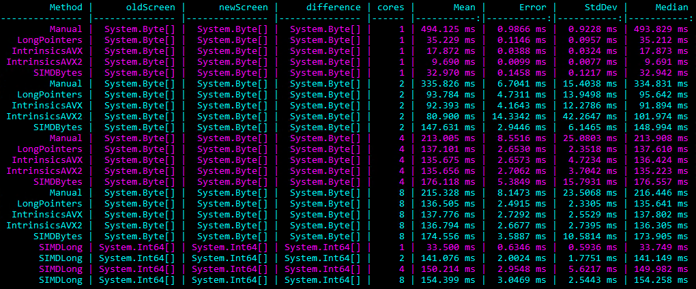

# Introduction

This repository just contains some of my micro benchmarks regarding intrinsics in .NET.

Please beware that micro benchmarks are usually *not* a good way of measuring performance.

# XOR

Here I want to use `Intrinsics` to XOR bytes as fast as possible. The way I found using `Intrinsics` (or SIMD) is compared to the fastest way possible without `Intrinsics`.

Currently this is the fastest way of XORing on my Hardware:

```csharp
Avx2.Store(ppDiff, Avx2.Xor(Avx2.LoadVector256(ppOld), Avx2.LoadVector256(ppNew)));
```

# XORParallel

I observed that various techniques don't work well in parallel. Here you can see benchmarks on a 4 core Xeon:



In this case AVX2 just needs ~10 ms when using one core, but 80 ms when using two cores. I will investigate in this.